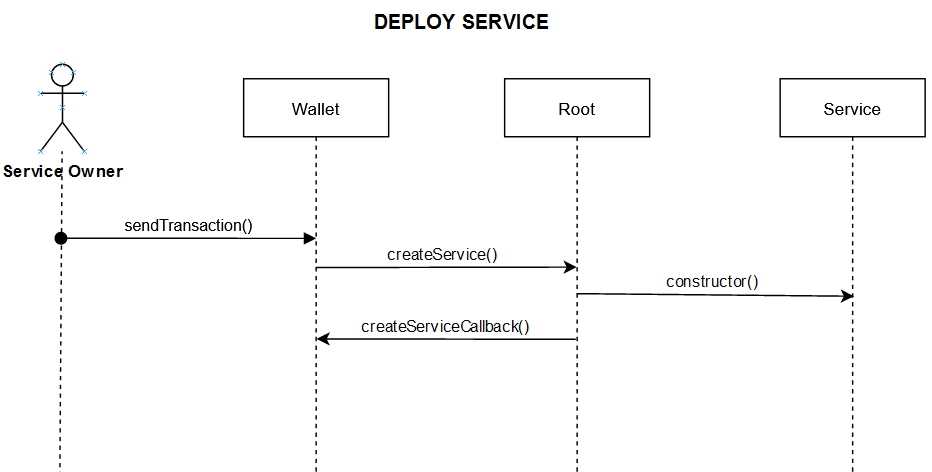
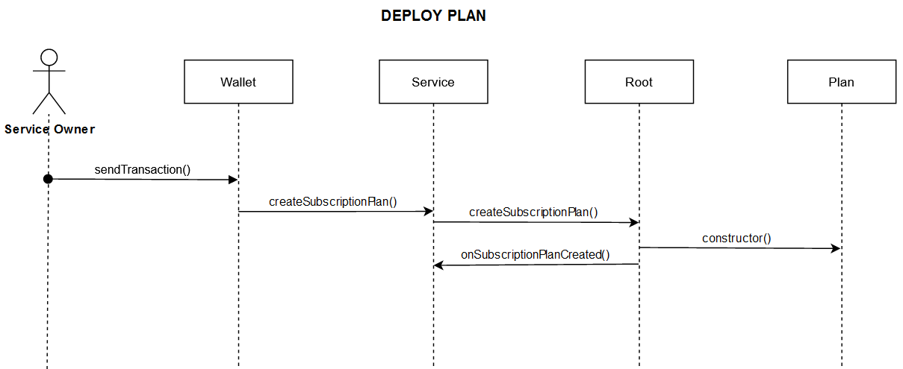
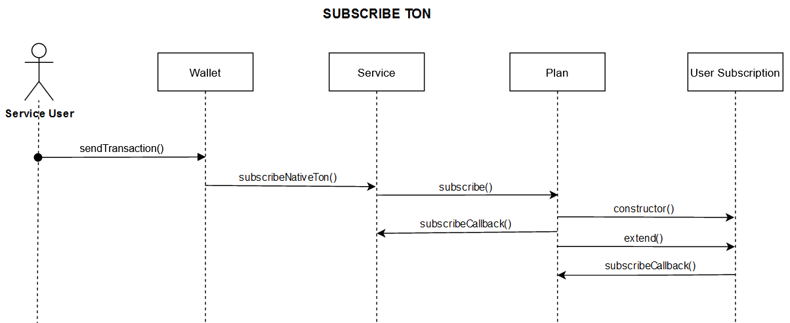
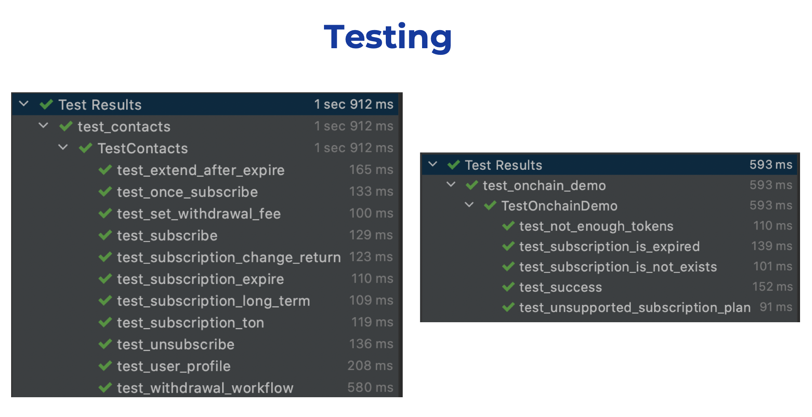

# Free TON subscriptions

Project Github: https://github.com/tonred/tonclick

Off-chain demo Github: https://github.com/tonred/tonclick-demo

Off-chain demo site: https://demo.ton.click/

Root address in devnet: `0:61688335efeaffefc7b855e4e814dd6c7a2e768ebdf3bf0eef45004ce166c791`

DeBot for Service address in devnet: `0:3a4dfa2c931767f706b1a94a22699117bc8ea361a60f2ff3bccc70cd3827c456`

DeBot for User address in devnet: `0:a8d4f71427003c3e75d5047003da399da2809450d7c783f5311d2837de324425`

Push request: `todo`


## Key features:
* On-chain and off-chain subscriptions
* Many subscription plans for each services
* Custom configuration of each subscription plan
* Infinity amount of services and users, no mapping
* On-chain and off-chain demos
* Native Ton and TIP3 tokens support


## Build and run

### Requirements:
* [solc](https://github.com/tonlabs/TON-Solidity-Compiler) `0.47.0` ([this commit](https://github.com/tonlabs/TON-Solidity-Compiler/commit/eb3b5023e7250316ab259a898bc778e1816b4ce9))
* [tvm_linker](https://github.com/tonlabs/TVM-linker) `0.13.19`
* python `>=3.8`
* nodejs


### Setup environment
```shell
make setup
```
After this copy path to solc binary file to compiler.path, path to tvm linker binary file to linker.path

Install python requirements for tests:
```shell
pip install -r test/ts4/requirements.txt
```

Compile and test:
```shell
make compile
make tests
```

View all make instructions:
```shell
make help
```


## Deployment

```shell
make deploy
```


## On-chain and off-chain usage

To subscribe on-chain, user should pass only address and set pubkey to 0

To subscribe on-chain, user should pass only pubkey and set address to 0

Also, this should be used if user want to see all his subscription via user profile


## Usage

Infinity amount of services can be deployed from root contract.
To deploy new service use `createService` method in root

```solidity
function createService(
    address owner,
    string title,
    string description,
    string url
)
```

Each service can create many subscription plans.
To deploy new subscription plans use `createSubscriptionPlan` method in service.
Subscription plan can have max count of subscribers

```solidity
function createSubscriptionPlan(
    uint128 tonPrice,  // price in Ton, use 0 to disable payment in Ton
    mapping(address => uint128) tip3Prices,  // mapping of root=>amount TIP3 prices
    string title,  // title info
    uint32 duration,  // duration info in seconds
    string description,  // description info
    string termUrl,  // link to subscription plan terms
    uint64 limitCount  // max count of subscribers, use 0 for unlimited
)
```

User can easily subscribe or extend subscription plan.
He must not remember if subscription already exists.
If user want to subscribe, he should create a `payload` in service
via `buildSubscriptionPayload` function, and then pass this `payload`
depends on payment method.

**Pass only `user` or `pubkey` value** [see more here](#on-chain-and-off-chain-usage),
set `autoRenew` if you need reminds for renewal.
If user wants to pay via TIP3 tokens, he should transfer this right amount of tokens
and `payload` to service.
If user wants to pay via Ton, he should call `subscribeNativeTon` method in service.
In any exception, TIP3 or Ton tokens will be returned.
See functions below

```solidity
function buildSubscriptionPayload(
    uint32 subscriptionPlanNonce,  // nonce of subscription plan
    address user,  // pass address only if use on-chain, otherwise address(0)
    uint256 pubkey,  // pass pubkey only if use off-chain, otherwise 0
    bool autoRenew
)
function subscribeNativeTon(TvmCell payload)
```

User can unsubscribe from plan in any time. Unsubscription means that user don't want to
renew this plan anymore, but subscription will be active until plan `period` will be ended
because user already paid for all this `perion`. To unsubscribe user should build `payload`
via `buildUnsubscribePayload` in subscription plan and pass it to `unsubscribe`

```solidity
function buildUnsubscribePayload(address user, uint256 pubkey)
function unsubscribe(TvmCell payload)
```

Owner of service can deactivate and activate again any subscription plan by
calling corresponding method in subscription plan. Also, owner can change
TIP3 and Ton prices of subscription plan

```solidity
function activate()
function deactivate()
function changeTonPrice(uint128 price)
function changeTip3Prices(mapping(address => uint128) tip3Prices)
```

There is a fee for using the service. This fee defined in root and
can be changed be root owner. Owner of service can withdrawal
Ton or TIP3 income in any time by calling corresponding method in service.
To withdrawal TIP3 income owner should specify root of that he want to withdrawal

```solidity
function withdrawalTonIncome()
function withdrawalTip3Income(address tip3Root)
```


## Diagrams






## Tests

To run tests use:
```shell
make tests
```

There are two test files: for contracts and for on-chain demo.
Test is written on python using `unittest` library




## Off-chain demo
Off-chain demo Github: https://github.com/tonred/tonclick-demo

Off-chain demo site: https://demo.ton.click/

### Workflow:
1. Service generates a random temporary key and passes it to the user via WebSockets 
2. User input this value in Surf DeBot(QR code or manually)
3. DeBot shows user domain of the Service he is trying to access and asks to sign payload with his private key. Payload contains user public key, Service domain, and temp key from backend 
4. After payload signing, hash of payload and user public key sends to Service vai https request.
5. Service check signature with pubkey
6. Checks if user with such public key has active matching subscriptions
5. Service grants JWT token to user via websockets, which will provide access to the private methods of service API 


**Important:** for off-chain plans user subscriptions must be created only by user pubkey


## On-chain demo

Everyone can easily integrate on-chain service with subscriptions.
To do this, your contract should implement [IOnchain.sol](contracts/onchain/IOnchain.sol) class.
There is a [demo](contracts/onchain/OnchainDemo.sol) of such service,
that give 10 tokens to everyone who has a subscription

**Important:** for on-chain plans user subscriptions must be created by user address


## Debots

# **todo**
